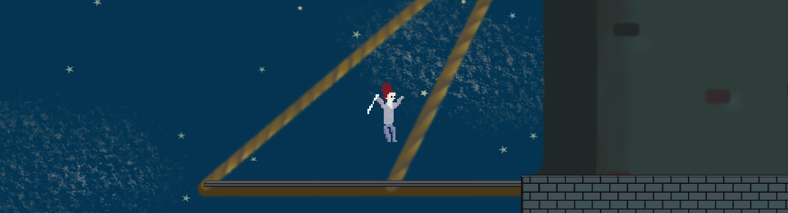
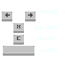

# Hunt the Gargul  
An entry to the Vim Jam 2021

## Goal

You are a mage warrior who is sent to defeat the Gargul. The stone monster lives in an old castle. You need to find him and push out of the Castle. But be careful! Gargul's attacks are extremly strong and if he reaches you, good luck to you. 

## Controls

## Authors

- Antoni Gradowski
- Marcin Szubert
- Łukasz Szubert
- Karolina Janicka
